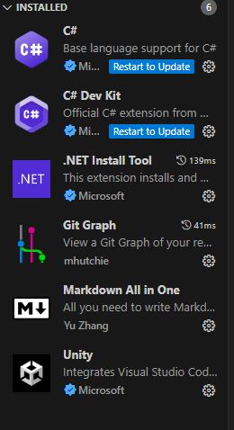

# Chuleta basica de Markdown

## Esto es menos importante

### Esto es aun menos importante

**Marcado**.

*Cursiva*.

Esto es una prueba de texto. No te olvide de poner el punto al final.

>codigo

- Lista desordena
- Sigo con la lista
- Fin

1. Lista ordenada
2. Sigo
3. Fin

---

Lineas por debajo o arriba

---

[Esto es un enlace](https://www.markdownguide.org/cheat-sheet/)

